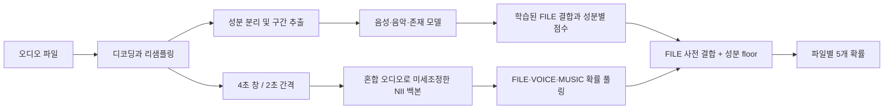

# 다중 도메인 딥페이크 오디오 탐지

**English abstract.** A five-output detector for fake speech, generated music, and mixed audio. The final public leaderboard score was **0.84524 (54th)** in DACON 236749. The most useful gain came from fine tuning a speech anti-spoofing backbone on labeled rendered mixtures. This repository documents the final inference code, experiment history, and reproduction limits; licensed audio and model weights are excluded.

## 문제와 평가

오디오 파일 하나에서 `FILE_FAKE`, `VOICE_FAKE`, `MUSIC_FAKE`의 확률과 `VOICE_PRESENT`, `MUSIC_PRESENT`의 확률을 각각 예측한다. 음성이나 음악이 함께 있거나 일부 구간만 합성된 파일도 대상이다. `VOICE_FAKE`와 `MUSIC_FAKE`의 EER은 해당 성분이 있는 파일에서만 계산한다. 점수 구현은 [metrics.py](src/deepvoicehackathon/metrics.py)에 있다.

`ADS = 0.5(1 − FILE EER) + 0.2(1 − VOICE EER) + 0.3(1 − MUSIC EER)`, `CPS = 0.5(VOICE presence AUC) + 0.5(MUSIC presence AUC)`, 최종 `Score = 0.9 ADS + 0.1 CPS`. EER은 ROC의 FPR과 FNR 차이가 가장 작은 지점에서 두 값을 평균한 것이다.

| 최종 선택 | Score | ADS | CPS | 공개 순위 |
|---|---:|---:|---:|---:|
| sub102r3 | **0.8452467831** | 0.8292380952 | 0.9893249735 | **54위** |

마지막 상승 구간은 0.83686(57위)에서 0.84524(54위)였다. 15위 커트라인 0.87989에는 도달하지 못했다. 점수와 순위는 공개 리더보드 기준이다.

## 추론 구조



최종 코드는 [final_inference.py](src/final_inference.py)다. 기반 스택의 음악 구간 헤드와 FILE29/VOICE 결합에 sub98 FILE, sub99 VOICE 헤드를 더하고, sub102r3의 NII 다중 라벨 모델을 FILE/VOICE/MUSIC에 각각 **0.15/0.10/0.35** 비중으로 결합했다. 존재 확률은 유지했다. 파일별 오류는 기존 결과로 되돌리도록 설계했다.

## 실제로 통했던 것과 그렇지 않았던 것

| 실험 | 공식 Score | 판단 |
|---|---:|---|
| sub97b: 배포 창에 맞춘 음악 헤드 | 0.836861 | 이전 최고점 |
| sub100: 얇은 FILE/VOICE 개선 결합 | 0.834597 | 개별 패널 개선이 합쳐지지 않음 |
| sub102: 렌더링 혼합물 미세조정 r2 | 0.841868 | sub100 대비 +0.007271 |
| **sub102r3: 전체 transformer 층을 추가 학습** | **0.845247** | sub100 대비 **+0.010650** |
| sub106: 실데이터 절반으로 추가 학습 | 0.843932 | 로컬 2-fold 개선에도 공식 점수 하락 |
| sub111 / sub112: 실데이터 전체 추가 학습 | 0.839440 / 0.842554 | 최종 선택에서 제외 |

혼합물 홀드아웃 개선은 공식 향상을 약 8배 과대평가했다. 반대로 r3의 추가 학습 이득은 패널이 과소평가했다. 실데이터 미세조정의 로컬 패널 이득 역시 숨겨진 평가 데이터에 이전되지 않았다. 과정과 근거는 [journey](docs/journey.md), [experiments](docs/experiments.md), [lessons](docs/lessons.md)에 정리했다.

이 실험들은 Codex와 Claude AI 코딩 에이전트를 오케스트레이션해 수행했다. 연구 방향, 가설, 채택과 중단 결정은 내가 내렸고, 에이전트가 구현과 실험 실행을 맡았다.

## 저장소 구성과 재현

- `src/final_inference.py`: 최종 제출 추론 프로그램. 모델 파일을 상대 경로 `src/model/`에서 읽는다.
- `src/deepvoicehackathon/`: 점수 계산과 실험에 쓰인 성분 결합 코드.
- `tools/`: 혼합물 준비, NII 학습·평가·내보내기 도구.
- `configs/`: 최종 혼합 비중과 풀링 계수의 기록. 원본의 절대 경로는 포트폴리오용 상대 경로로 바꾸었다.
- `experiments/`: 공식 제출 전체 기록과 주요 대안 실험의 코드·보고서.

Python 3.11을 사용한다. 기본 개발 환경은 `pip install -e ".[dev]"`, 추론용 선택 의존성은 `pip install -e ".[dev,inference]"`로 설치한다. PyTorch, torchaudio, ONNX Runtime은 CUDA 환경에 맞는 배포판을 별도로 설치해야 한다. [data-and-licenses](docs/data-and-licenses.md)의 원천에서 라이선스를 확인하고 필요한 오디오와 모델을 직접 구해 `$DATA_DIR`에 준비한다. 원래 제출 패키지의 모델 파일과 경로 체계를 `src/model/`에 재구성해야 최종 추론이 가능하다. 가중치가 없는 공개 저장소만으로는 공개 점수를 재현할 수 없다.

```powershell
$env:DATA_DIR = 'data'
python -m pytest tests/test_metrics.py
python src/final_inference.py --test-dir "$env:DATA_DIR/test" --sample-submission "$env:DATA_DIR/sample_submission.csv" --output predictions.csv --device cuda
```

데이터, 외부 모델, 원본 라이선스는 이 저장소의 MIT 라이선스에 포함되지 않는다. [라이선스와 입수 경로](docs/data-and-licenses.md)를 먼저 확인해야 한다. DACON 기본 코드와 사용한 외부 모델·데이터 제작자에게 감사한다.
